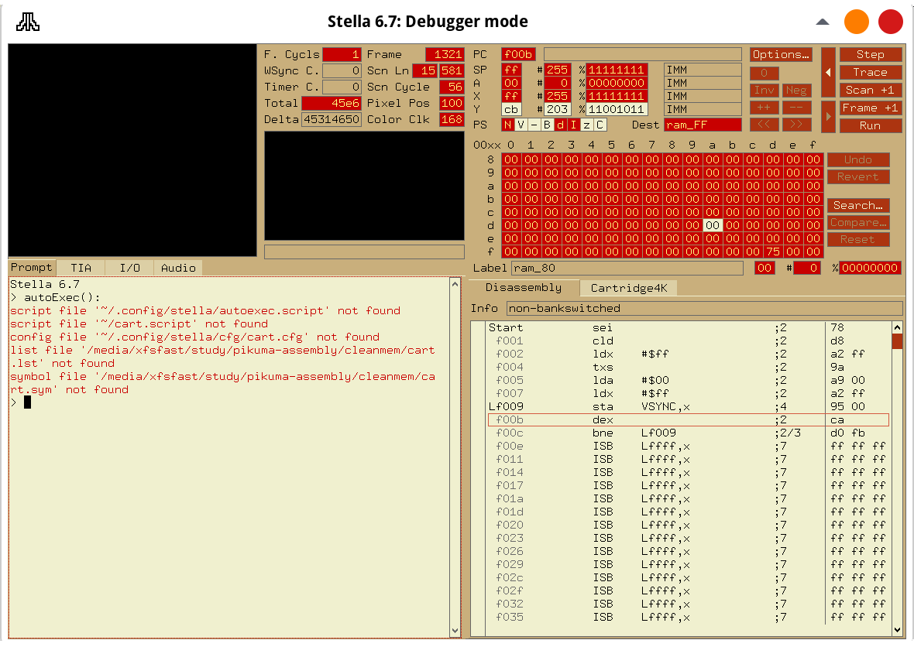

# Atari 2600 Programming with 6502 Assembly

## Dasm

```shell
mkdir Dasm
wget https://github.com/dasm-assembler/dasm/releases/download/2.20.14.1/dasm-2.20.14.1-linux-x64.tar.gz
tar xvf dasm-2.20.14.1-linux-x64.tar.gz
```

update `PATH` in `.bashrc`

```shell
export PATH="$PATH:/home/fahmad/Dasm/"
```

logout or source the new bash config

```shell
source ~/.bashrc
```

## Stella

```shell
sudo dnf install stella
```

to see debugger mode, click backtick \` key.



## Digital Binary System

### convert binary to hexadecimal

|   00011011    |               |
| :-----------: | :-----------: |
| 0001 (nibble) | 1011 (nibble) |
|       1       |      11       |
|       1       |       B       |
|      1B       |               |

## 6502 assembly instructions

```assembly
    ldy #100    ;y=100
Loop:
    dey         ;y--
    bne Loop    ;repeat until y == 0
```

# References

- https://pikuma.com/courses/learn-assembly-language-programming-atari-2600-games
- https://dasm-assembler.github.io/
- https://stella-emu.github.io/index.html
- http://www.6502.org/tutorials/6502opcodes.html
- https://marketplace.visualstudio.com/items?itemName=simondotm.beeb-vsc
